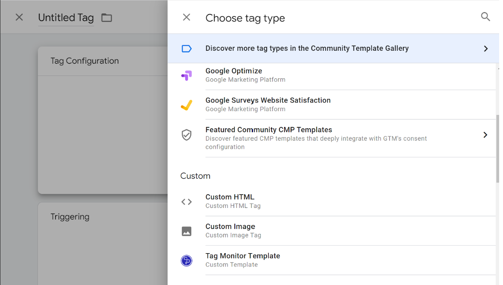
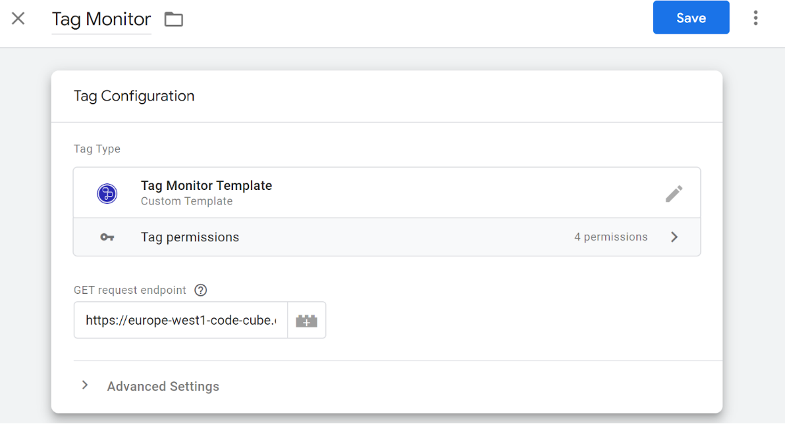
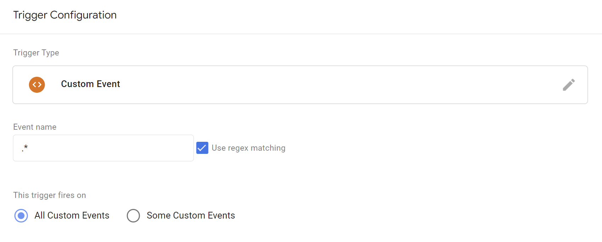
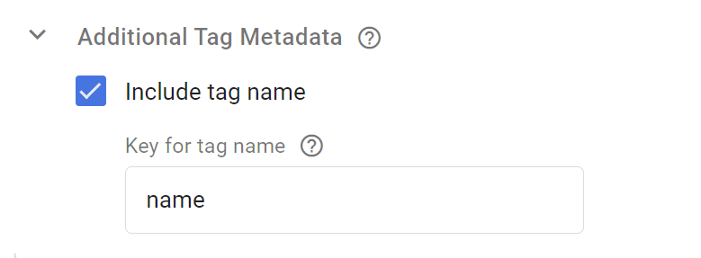

# client-side Tag Monitor Implementation

## How to set up the tag monitor

To implement the Tag Monitor for a client in Google Cloud Platform, please follow these steps accordingly.             

#### 1. **Make sure the Code Cube infrastructure is ready**

   -  Let us know that you would like to implement the Tag Monitor for a new client and we will prepare this implementation in our cloud environment.

   -   As a result you will receive a request endpoint, which you need in a later step. Example: https://europe-west1-code-cube.cloudfunctions.net/tag-monitor-{{client_name}}                

#### 2. **Update your Google Tag Manager container**

   -   Import the Tag Monitor template into your Tag Manager container
      You can find the template [here](https://gitlab.com/code-cube-standards/tag-monitor-implementation/-/blob/main/   gtm-templates/Code_Cube_Client_Tag_Monitor_Template.tpl){:target="_blank"} in this repository.
   -   Go to templates in your Tag Manager container and click on ‘New’.

   

#### 3. **Import the template into your workspace**      

   -   Click on the three dots in the right corner and select ‘Import’. Select the Tag Monitor template you’ve just       downloaded and click on ‘Save’. You don’t need to make any adjustments to the template.

   

#### 4. **Create a new tag based on this template**

   -   Create a new tag under ‘Tags’ in the menu.
   -   Select the Tag Monitor Template as tag type, this is the template you have just added to the container.
   
   

#### 5. **Configure the tag**

   - Add the request endpoint in the field ‘GET request endpoint’. Give the tag a descriptive name. 

#### 6. **Add a new Custom Event Trigger to the tag**

   - Create a trigger for a custom event where event name equals .\* (use regex matching). With that regular expression for the event name, the monitor tag will fire for every single dataLayer event.
   
   - To limit the number of times Tag Monitor fires, click "Some custom events" and select Random Number in the first dropdown menu.\
   If it's not in the list, create a built-in variable Random Number and repeat.
   - For 10% of the events choose: Random number ends with 1.
   - For other cases, calculate the expected percentage from 2,147,483,647 (Random Number value) and fire the tag in that number of cases. For example, if you need to limit Tag Monitor firing to 5% of events, use: Random number is less than or equals to 107,374,182 (2,147,483,647\*0.05).

   
#### 7. **Update all your tags to include the tag name in the meta data**

   - For each tag, expand the Advanced Settings and check the ‘’Include tag name’ checkbox under Additional Tag Metadata. Set the key name to name as well.
    

   - If you're dealing with a large number of tags, please follow [these steps](https://gitlab.com/code-cube-standards/tag-monitor-implementation/-/wikis/Tags-bulk-edit){:target="_blank"} to update them.

## You are done. Let’s go live!

   1. Publish your Tag Manager container to your production environment.
   2. You’ve received access to the Portal from us. In the Portal you can find your Tag Monitor dashboard. Data should now automatically come in!

## Configuring Error Monitoring Notifications

To enable error monitoring notifications, you can access our portal and navigate to the tag monitor configuration page. From there, select your desired method of receiving notifications based on your subscription model, such as Email, Slack, or Teams. Fill in the required fields accordingly for each method.
To configure error monitoring notifications, follow the steps below:

#### **Email Notifications**
1. Go to our portal and access the tag monitor configuration page.
2. Activate the toggle switch to enable email updates.
3. Provide the email addresses where you wish to receive the notifications.

#### **Slack Notifications**
1. Go to our portal and access the tag monitor configuration page.
2. Activate the toggle switch to enable Slack updates.
3. Open your Slack Workspace and copy the workspace ID by clicking on the workspace name. 

4. Paste the workspace ID into the corresponding field in the configuration page and save the form.
5. You will be prompted to log in to your workspace and authorize our Tag Monitor Alerts app.
6. After authorizing the app, add it to your workspace by clicking the **add apps** button and selecting the app.
7. Invite the app to the desired channel where you want to receive the notifications by clicking on the channel name, going to the integrations tab and, adding the app.

#### **Teams Notifications**
1. Go to our portal and access the tag monitor configuration page.
2. Activate the toggle switch to enable Teams updates.
3. Follow [these steps](https://learn.microsoft.com/en-us/microsoftteams/platform/webhooks-and-connectors/how-to/add-incoming-webhook?tabs=dotnet){:target="_blank"} to create an incoming webhook for the channel where you want to receive the notifications.
4. Copy the generated Webhook URL and paste it into the corresoinding field and save the form.
