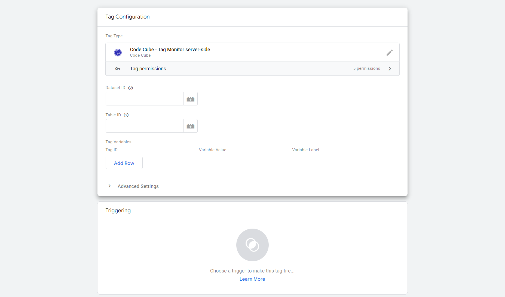

# server-side Tag Monitor Implementation

#### 1. **Build a custom GTM template**

In Google Tag Manager, open up the Templates view, and create a new tag template. You can download template [here](https://gitlab.com/code-cube-standards/tag-monitor-implementation/-/blob/main/gtm-templates/Server_Container_Tag_Monitor.tpl) and [import](https://www.simoahava.com/analytics/custom-templates-guide-for-google-tag-manager/#importing-and-exporting) it directly into your container.

#### 2. **Create a monitoring tag** 

In GTM, go to Tags and create a new tag. Select the template you just created from the tag type selector. Now you need to configure the tag. There are three fields you need to set:
- Project ID – set to the GCP project ID of the project where the BigQuery table is. If it’s the same project as the one running your Server container, you can leave this field blank.
- Dataset ID – set to the Dataset ID of the BigQuery table.
- Table ID – set to the Table ID of the BigQuery table.

**Note:** You will be given the value for the above-mentioned field from us.        
Expand Advanced Settings and scroll down to Additional Tag Metadata. Click it open, then click the + Add Metadata button, and set these values:
    Key: `exclude`
    Value: `true`

#### 3. **Add a trigger**          

Go to Triggers and click NEW to create a new trigger which will fire on all events. Add this trigger to your monitoring tag, and then save the tag. To limit the number of times Tag Monitor fires, click "Some events" and select Random Number in the first dropdown menu (if it's not in the list, create a built-in variable Random Number and repeat). For 10% of the events, choose Random number -> ends with -> 1. For other cases, calculate the expected percentage from 2,147,483,647 (Random Number value) and fire the tag in that number of cases. For example, if you need to limit Tag Monitor firing to 5% of events, use: Random number -> less than or equals to -> 107,374,182 (2,147,483,647*0.05).        

#### 4. **Update all your tags to include the tag name metadata**

For each tag, expand the Advanced Settings and check the Include tag name checkbox under Additional Tag Metadata. Set the key name to `name`. If you're dealing with a large number of tags, please follow [these steps](z-tag-bulk-edit.md){:target="_blank"} to update them. If needed, you can add even more key-value pairs to the tag metadata – you just need to modify the monitoring template to add these to the BigQuery API call. And, of course, you need a BigQuery table schema that accepts the new values.                    

 
#### 5. **Check results**

Open Preview and validate that everything works as expected. Note that in the server container preview mode a webpage is not opened automatically, so you should manually open it to see the data streaming. Another way to validate that Tag Monitor is working is to check the results in the BigQuery table.   

**Note:** To check the results in preview, you need to open the preview on GTM client container simultaneously with the server-side preview. 
    

#### 6. **Grant Permission**

This can be done in IAM & Admin > Service Accounts in Google Cloud Platform. Copy the email of associated services below and send it to us in order to be granted access to our BigQuery.

- The service account under which the server-side tracking is added.
- The **compute engine** service.

## Configuring Error Monitoring Notifications
Follow the steps [here](../notifications.md){:target="_blank"} to enable notifications for Tag Monitor.