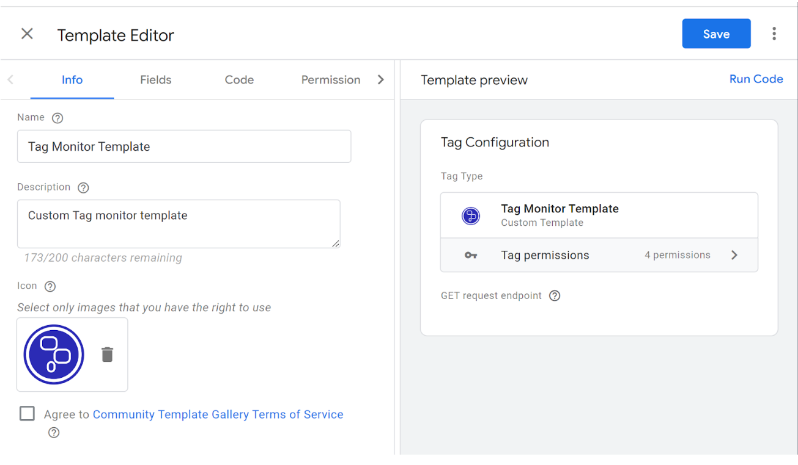

---
hide:
  - toc
---

# Google Tag Manager server-side: Configuring Tag Monitor

This guide will walk you through the steps to set up the Tag Monitor within your Google Tag Manager server-side container.

## Configuration in the Google Tag Manager Container

### Importing Custom Template

**1. Download Template:** Visit the [Tag Monitor configuration page](https://portal.code-cube.io/tag_monitor_config) and download the Tag Monitor template. (Ensure you're logged into our portal.)

**2. Add Template to Google Tag Manager:** Open your Google Tag Manager container. Navigate to "Templates" and click on "New" in the "Tag Templates" section.

**3. Import Template**

- Click on the three dots in the top-right corner and select "Import".
- Choose the Tag Monitor template you've downloaded and click "Save". No adjustments to the template are necessary.
  

### Configuring the Code Cube Tag Monitor Tag

**4. Create New Tag**: Under "Tags" in the menu, create a new tag.

**5. Select Tag Monitor Template**: Choose the Tag Monitor Template as the tag type.  

**6. Configure Settings**: 

- **Database Name**: Retrieve from the configuration page in the portal under 'client-side error monitoring'.
- ** Table Name**: Retrieve from the configuration page in the portal under 'client-side error monitoring'.
- **Add Metadata**: Set the following key/parameter pair via "Additional Tag Meta":
     - Key: `exclude`
     - Parameter: `true`
- **Consent**: Set to 'No additional consent required'.  

### Adding Trigger to the Tag

**7. Create Trigger**: Create a trigger for a custom event where the event name equals `.*` (using regex matching). This ensures the monitor tag fires for every single dataLayer event.  

**8. Limit Tag Monitor Fires**:  

- Choose "Some custom events" and select "Random Number" from the first dropdown menu.
- For 10% of events, select: "Random number ends with 1".
- For other cases, calculate the expected percentage from 2,147,483,647 (Random Number value) and fire the tag accordingly.

### Update all your tags to include Tag Name

**9. Update meta data in all tags**

- For each tag, expand "Advanced Settings" and check the "Include tag name" checkbox under "Additional Tag Metadata". Set the key name to "name" as well.
- If dealing with a large number of tags, follow [these steps](z-tag-bulk-edit.md){:target="_blank"} to update them.

### Final Steps: Going Live

**10. Publish Container**:  

- Publish your Tag Manager container to your production environment.

**11. Access Tag Monitor Dashboard**:  

Access your Tag Monitor dashboard in the Portal provided by us. Data should now automatically populate.

## Configuring Error Monitoring Notifications
Follow the steps [here](../notifications.md){:target="_blank"} to enable notifications for Tag Monitor.
