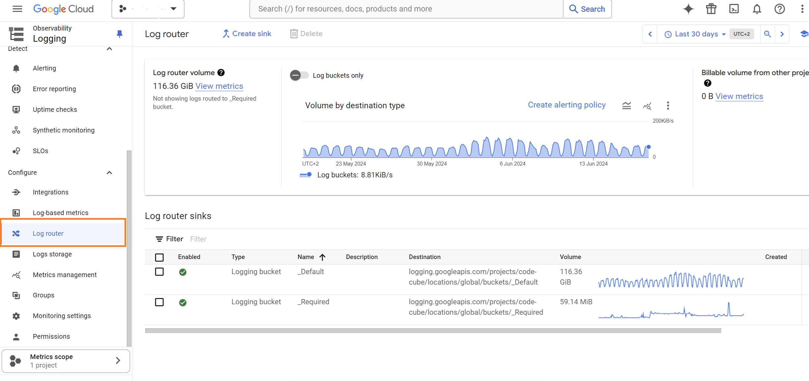
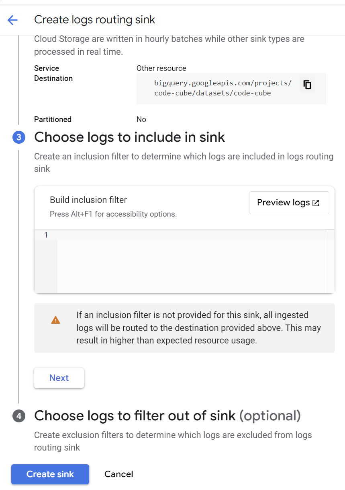

# Monitoring server-side GTM logs

❕This feature is only available with the Tag Monitor's premium and enterprise licenses.

Logs are an essential tool for monitoring your server-side tagging. They help troubleshoot issues with requests, identify missing data, and understand how a vendor processed a request.

Logs are available for all tags that have the “logging to console” option available in in the server-side GTM container. That means that it is **not possible** to retrieve log data for Google Analytics and Google Ads tags, as these default templates don’t have the logging option available in the default templates.

Logging will be set up in the Google Cloud Project where your GTM server-side container is running in a Cloud Run instance. From there you link the logs to the Code Cube environment. The logs received in our environment will then be matched with other error information and integrated into dashboarding and notifications.

Here are the steps we'll cover:

1. **Configure Logging Sink**: Set up a logging sink in the Google Cloud Platform project where server-side Tag Management via a Cloud Run instance is enabled.
2. **Grant Access**: Make sure that Code Cube's project can access this sink and its logs.

## **Set-up of logging in your Google Cloud Project Setup**

### Navigate to “Create Sink”

1. Open the Google Cloud Platform project where the server-side tagging Cloud Run service is enabled.
2. Navigate to [Log Router](https://console.cloud.google.com/logs/router) in the Google Cloud Platform, which is one of the options under Logging page.
    
    
    
3. On this page select the ‘Create sink’ option, on top of the page
    
    

### Create logs routing sink

1. Add **sink details**
    - **Sink name**:  ‘codecube-serverside-logs’
    - **Sink description:** Give extra description on the sink (optional)
        
        

        
2. Add **sink destination**
    - **Select sink service:** Select ‘Other resource’
    - **Sink destination:** `bigquery.googleapis.com/projects/code-cube/datasets/{{dataset}}`
        - Your {{dataset}} value can be found on the configuration page in the portal.
            
        
            
3. **Choose logs to include in sink**
    - Input the following query in the log filters section:
    `logName=~"stdout" AND textPayload!~"https://www.googletagmanager.com/sgtm/a" AND textPayload!~"Listening"`
    
    Explanation:
    
    - `logName=~"stdout"`: Filter logs based on stdout.
    - `textPayload!~"https://www.googletagmanager.com/sgtm/a"`: Exclude GTM analytics pings.
    - `textPayload!~"Listening"`: Exclude instance initializations.
    
    Note: Additional filters can be added for refinement, but test them in the logs explorer before applying to avoid disruptions in log writing.
    
    
    
5. Choose logs to filter out of sink 
    - This step can be skipped, you can directly click on the button ‘Create sink’.

After you click on the button ‘Create sink’ you should be redirected to the page where the message shows up on the top of the page.

   

## **Manage Access to the sink**

When creating a logging sink in your Google Cloud Platform, a **service account** is automatically created. Please locate this service account via IAM and share the name with Code Cube via support@code-cube.io.

**How to locate the service account:**

1. Go to IAM and admin → [IAM](https://console.cloud.google.com/iam-admin/iam).
2. Activate Google-provided role grants at the top right of the page.
    
    
    
3. Search for the service account that ends with `logging.iam.gserviceaccount.com`.
4. Copy and share the name of this service account, which will be granted write permissions on the relevant dataset with support@code-cube.io.
