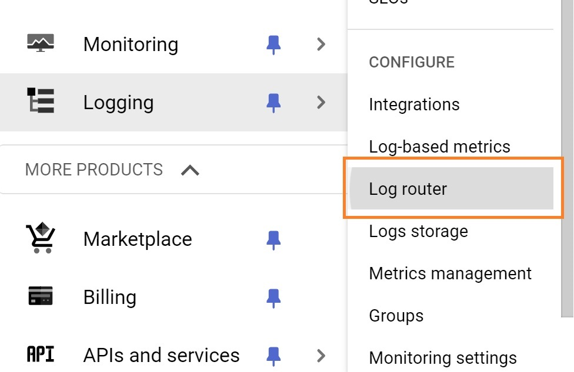
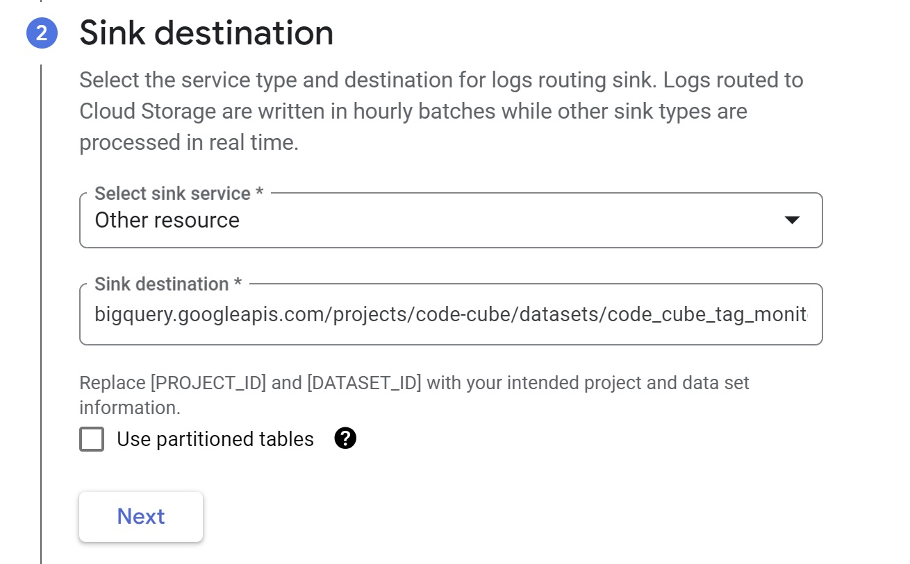

# Server-side GTM Logging

## Introduction
To provide additional information on error occurrences of the Tag Monitor, it is important to enable logging configurations in your Cloud environment. This document serves as a short implementation guide on setting up the necessary Logging Sink and offload the data to Code Cube's project.

The following steps have to be taken:

1. Configure logging sink in the Google Cloud Platform project where *server-side Tag Management* is enabled.
2. Make sure Code Cube's project receives access to this sink and the logs.

## Log Router Setup
1. Open the your Google Cloud Platform project where your Cloud Run service for Google Tag Manager server-side is enabled.
   
2. Via the navigation, go to the Log router page, found under Logging → Log router.



3. Click on Create sink.


This will open a new interface, where the relevant destinations, services, and logging filters are submitted.

4. Give the router an appropriate name and description: For example 'code-cube-error-logs'.

5. Configure the destination as a BigQuery dataset and select 'Use a BigQuery dataset in another project'.




6. Copy the Sink destination below and add it in the destinated field:

```
bigquery.googleapis.com/projects/code-cube/datasets/code_cube_tag_monitor	. Make sure to add `[PROJECT_ID]` as **'code-cube'** and `[DATASET_ID]` is equal to the dataset name shown on the Tag Monitor configuration page.
 ```


9. In the log filters, input the following query:

    ```
    logName=~"stdout"
    AND textPayload!~"https://www.googletagmanager.com/sgtm/a"
    AND textPayload!~"Listening"
    ```

    - Explanation:
      - `logName=~"stdout"`: Filter logs based on stdout.
      - `textPayload!~"https://www.googletagmanager.com/sgtm/a"`: Exclude GTM analytics pings.
      - `textPayload!~"Listening"`: Exclude instance initializations.
    
__Keep in mind that further refinement is possible by adding more filters, however, be sure to test these in the logs explorer before applying. A faulty or unreturning filter will cause the sink to stop writing logs.__

## Manage access to the Sink

1. The creation of a logging sink automatically generates a new service account in your GCP project.
2. Please make sure to locate this service account and share the name with your contact at Code Cube.

How to find the service account;

1. This service account is found under IAM and admin → IAM.
2. On the Top right of this page, enable the inclusion of Google-provided role grants.
3. Look for the service account that ends with `-logging.iam.gserviceaccount.com`.
4. Copy the name of this service account, this will be assigned writing permissions on the relevant dataset.
